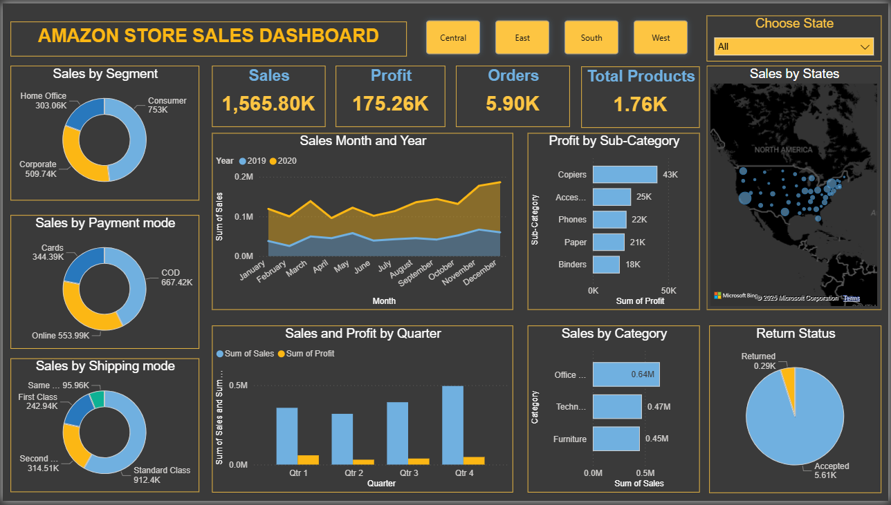

#  Amazon Store Sales Dashboard – Power BI

This repository contains an interactive **Amazon Store Sales Dashboard** built using **Power BI**.  
The dashboard provides a detailed visualization of sales performance across multiple dimensions such as segment, category, shipping mode, payment method, sub-category, and geographical state distribution.

---

# Project Overview

The Amazon Store Sales Dashboard helps users analyze:

- **Total Sales, Profit, Orders, and Products**
- **Sales Trends across Months & Years**
- **Sales and Profit by Quarters**
- **Sales by State (Map Visual)**
- **Sales by Segment (Consumer, Corporate, Home Office)**
- **Sales by Category & Sub-Category**
- **Sales by Payment and Shipping Modes**
- **Return Status (Accepted vs Returned)**

This visualization enables stakeholders to quickly understand sales patterns, identify profitable product lines, and discover growth opportunities.

---

# Business Questions Answered

- Which customer segment contributes the highest sales and profit?
- How do monthly sales trends compare between 2019 and 2020?
- Which product categories and sub-categories generate the most sales and profit?
- Which U.S. states drive the most revenue, and how does regional performance vary?
- What are the most preferred payment and shipping modes among customers?

---

# Dashboard Preview

---

# Tools & Technologies Used

- **Power BI Desktop**
- **DAX for Calculated Measures**
- **Interactive Filters (Region & State)**
- **Custom Visualizations**
